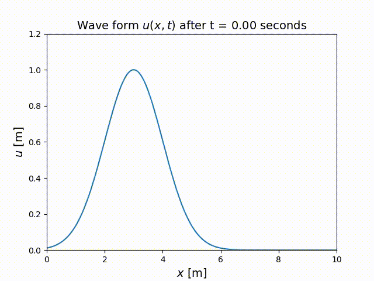
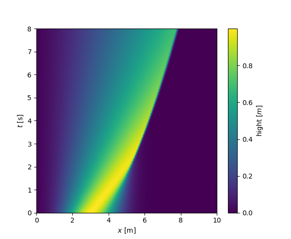

# Burgers' equation simulation 1D (simulation de l'équation de Burgers)

#### To cite this version: 
> Sacha BINDER. Étude de l’observation et de la modélisation des ondes de surface en eau peu profonde. Physique-Informatique.TIPE session 2021.

Python model solving the [Burgers' equation](https://en.wikipedia.org/wiki/Burgers%27_equation) in 1D. 

    </a>

All the process of calculation is based on [pseudo-spectral method](https://en.wikipedia.org/wiki/Spectral_method) and more particulartly by using the [Fast Fourier transform](https://en.wikipedia.org/wiki/Fast_Fourier_transform). Script is using [NumPy](https://numpy.org/), [Matplotlib](https://matplotlib.org/) and [SciPy](https://www.scipy.org/) libraries. A example of obtained solution after calculation is shown below :

    </a>
    </a>

